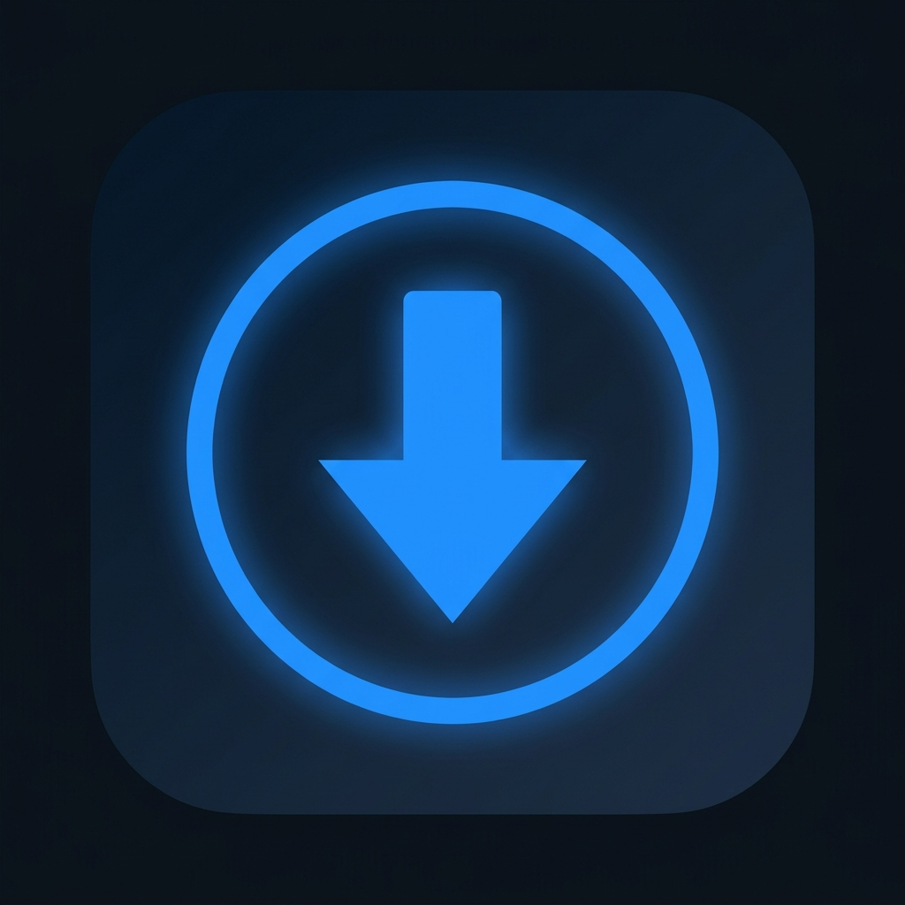

<div align="center">
  
  <h1>NexLoad ⚡</h1>
  <p><strong>Download Anything. At Full Speed.</strong></p>

  <p>
    <a href="#features">Features</a> •
    <a href="#architecture">Architecture</a> •
    <a href="#installation">Installation</a> •
    <a href="#configuration">Configuration</a> •
    <a href="#contributing">Contributing</a>
  </p>
</div>

---

## 📱 About NexLoad

**NexLoad** is a powerful, all-in-one download manager built with React Native (Expo) and FastAPI. It combines the power of native file system downloads with an advanced backend ecosystem to download files from almost anywhere on the internet.

Whether it's a YouTube video, a Telegram file, an Instagram reel, or a Magnet link — NexLoad handles it seamlessly with a beautiful, modern UI.


---

## ✨ Features

- **🚀 Universal Downloader**: Supports direct links, torrents/magnets, Telegram channels, and 1000+ video sites.
- **⚡ Background & Resumable**: Powered by Expo FileSystem, downloads continue in the background and can be paused/resumed dynamically.
- **📱 Beautiful UI/UX**: Built with a sleek, responsive design, dark/light mode support, and premium micro-interactions.
- **🤖 Telegram Integration**: Industry-first in-app Telegram authentication! Log into your own Telegram account securely and download files from any private group directly to your device.
- **🌐 Jackett Integration**: Connect your Jackett server to search across 400+ torrent indexers straight from the app.
- **🎨 Custom Styling**: Highly polished interface featuring glassmorphism elements, accent gradients, and fluid animations.

---

## 🏗️ Architecture

NexLoad consists of two main components:

1. **Frontend (Mobile App)**
   - **Framework**: React Native (Expo SDK 52)
   - **State Management**: Zustand (with MMKV for blazing-fast persistence)
   - **Icons**: Ionicons

2. **Backend (API Server)**
   - **Framework**: Python + FastAPI
   - **Video Engine**: `yt-dlp` (Extracts direct URLs from video platforms)
   - **Torrent Engine**: `libtorrent` (Native C++ torrent processing)
   - **Telegram Engine**: `Telethon` (Stateless multi-user MTProto client)

---

## 🛠️ Installation

### 1. Backend Setup

The backend handles heavy lifting (video extraction, torrent downloading, telegram auth) so the mobile app stays fast and compliant.

```bash
cd backend
python -m venv venv
source venv/bin/activate  # On Windows: venv\Scripts\activate
pip install -r requirements.txt
uvicorn main:app --host 0.0.0.0 --port 8000
```
> **Note:** For full functionality (Torrents), deploy the backend using the included `Dockerfile` to a Linux environment (like Render.com or Railway).

### 2. Frontend Setup

Make sure you have Node.js and Expo CLI installed.

```bash
npm install
npx expo start
```
Scan the QR code with the **Expo Go** app on your phone to start testing!

---

## ⚙️ Configuration

Open the **Settings** tab in the NexLoad app to configure integrations:

- **yt-dlp Server URL**: Point this to your hosted backend (e.g., `http://192.168.x.x:8000` for local testing).
- **Telegram Account**: Enter your phone number in the app to authenticate a stateless Telegram session.
- **Jackett Server URL**: Connect your self-hosted Jackett instance for built-in torrent searching.

---

## 🤝 Contributing

Contributions, issues, and feature requests are welcome!
Feel free to check the [issues page](https://github.com/SONUVERMA11/nextload/issues).

---

<div align="center">
  <p>Made with ❤️ by <strong>Sonu Verma</strong></p>
</div>
